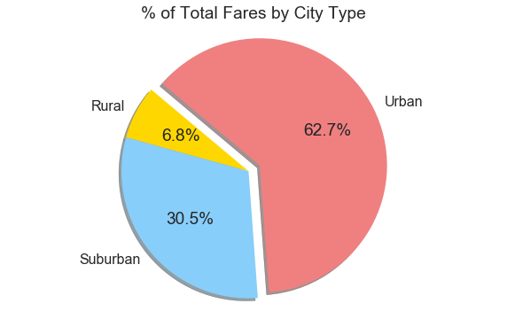
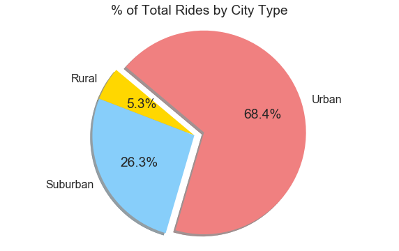
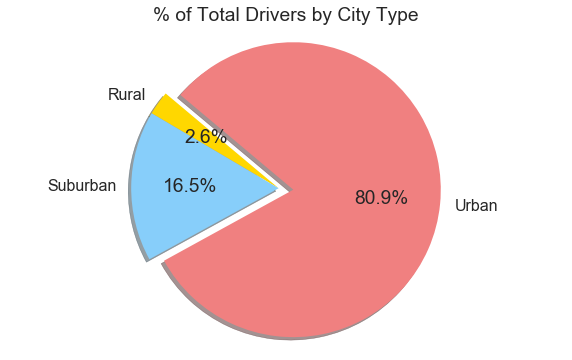

# Pyber Ride Sharing

## Analysis

- Average fares for Urban segment do not appear to exceed $30.

- Suburban rides make up 26.3% of total rides but 30.5% of total fares and 16.5% of total drivers, suggesting greater profitability in this segment.

- Urban drivers make up 80.9% of total drivers but provide only 68.4% of total rides, which suggests that a large percentage of Urban drivers are not providing rides and contributing to revenue.


```python
%matplotlib inline
```


```python
import matplotlib.pyplot as plt
import matplotlib.legend_handler as lh
import numpy as np
import pandas as pd
import seaborn as sns
```


```python
#Read raw data files
df_city_data = pd.read_csv('raw_data/city_data.csv')
df_ride_data = pd.read_csv('raw_data/ride_data.csv')

```


```python
#Merge data files, summarize data, and group by city and type
df_data_merge = pd.merge(df_ride_data, df_city_data, how='left', on='city')
df_city_group = pd.merge(df_ride_data, df_city_data, how='left', on='city').groupby('city')

df_city_summary = pd.DataFrame()
df_city_summary['average_fare'] = np.around(df_city_group['fare'].mean(), 2)
df_city_summary['total_rides'] = df_city_group['ride_id'].count()
df_city_summary['total_drivers'] = df_city_group['driver_count'].first()
df_city_summary['total_fares'] = df_city_group['fare'].sum()
df_city_summary['type'] = df_city_group['type'].first()

df_type_group = df_city_summary.groupby('type')

df_type_summary = pd.DataFrame()
df_type_summary['total_rides'] = df_type_group['total_rides'].sum()
df_type_summary['total_drivers'] = df_type_group['total_drivers'].sum()
df_type_summary['total_fares'] = df_type_group['total_fares'].sum()

```

## Bubble Plot of Ride Sharing Data


```python
#Create bubble chart
df_rural = df_city_summary[df_city_summary.type=='Rural']
df_suburban = df_city_summary[df_city_summary.type=='Suburban']
df_urban = df_city_summary[df_city_summary.type=='Urban']
```


```python

fig, ax = plt.subplots(figsize=(10,8))

ax.scatter(df_rural['total_rides'],
           df_rural['average_fare'],
           s=df_rural['total_drivers']*20,
           label='Rural',
           marker='o',
           facecolors='gold',
           edgecolor='black',
           linewidths=1,
           alpha=0.85
          )

ax.scatter(df_suburban['total_rides'],
           df_suburban['average_fare'],
           s=df_suburban['total_drivers']*20,
           label='Suburban',
           marker='o',
           facecolors='lightskyblue',
           edgecolor='black',
           linewidths=1,
           alpha=0.85
          )

ax.scatter(df_urban['total_rides'],
           df_urban['average_fare'],
           s=df_urban['total_drivers']*20,
           label='Urban',
           marker='o',
           facecolors='lightcoral',
           edgecolor='black',
           linewidths=1,
           alpha=0.85
          )

plt.figtext(1.01,0.85,'Note: Circle size correlates with number of drivers in each city.')

#Format legend
plt.legend(title='City Type',markerscale=0.5)

plt.title('Pyber Ride Sharing Data (2018)')
plt.xlabel('Total Number of Rides (Per City)')
plt.ylabel('Average Fare ($)')
plt.xlim(0,41)
plt.ylim(15,45)

sns.set_style('darkgrid')
sns.set_context('poster')

plt.show()

```


## Percent of Total Fares by City Type


```python
#Create Pie Charts
#Percent of Total Fares by City Type
plt.figure(figsize=(10,6))
plt.pie(df_type_summary['total_fares'],
        labels=df_type_summary.index.values,
        explode=[0,0,.1],
        colors=['gold','lightskyblue','lightcoral'],
        autopct="%1.1f%%", 
        shadow=True,
        startangle=140
       )

plt.title('% of Total Fares by City Type')
plt.axis('equal')
sns.set_context('poster')
plt.show()
```





## Percent of Total Rides by City Type


```python
#Percent of Total Rides by City Type
plt.figure(figsize=(10,6))
plt.pie(df_type_summary['total_rides'],
        labels=df_type_summary.index.values,
        explode=[0,0,.1],
        colors=['gold','lightskyblue','lightcoral'],
        autopct="%1.1f%%", 
        shadow=True,
        startangle=140
       )

plt.title('% of Total Rides by City Type')
plt.axis('equal')
sns.set_context('poster')
plt.show()

```





## Percent of Total Drivers by City Type


```python
#Percent of Total Drivers by City Type
plt.figure(figsize=(10,6))
plt.pie(df_type_summary['total_drivers'],
        labels=df_type_summary.index.values,
        explode=[0,0,.1],
        colors=['gold','lightskyblue','lightcoral'],
        autopct="%1.1f%%", 
        shadow=True,
        startangle=140
       )

plt.title('% of Total Drivers by City Type')
plt.axis('equal')
sns.set_context('poster')
plt.show()
```




